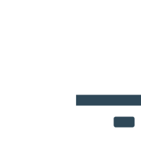

# PuntoFiel

<p align="center">
  
</p>

<p align="center">
  Una aplicación móvil de fidelización para negocios locales, construida con React Native y Supabase.
</p>

---

## ✨ Características principales

* *Registro y autenticación* para clientes y dueños de negocios.
* *Generación y escaneo de códigos QR* para una acumulación de puntos rápida y sin contacto.
* *Sistema de recompensas* gestionado por cada negocio.
* *Panel de control* para que los negocios puedan ver a sus clientes más leales.
* *Seguridad de datos* implementada con RLS (Row Level Security) de PostgreSQL.

---

## 🛠️ Stack tecnológico

Este proyecto utiliza un stack moderno, escalable y enfocado en la productividad.


---

## 📂 Arquitectura del proyecto

Utilizamos **Arquitectura Limpia (Clean Architecture)** para separar la lógica de negocio de los detalles de implementación. La estructura principal del código se encuentra en la carpeta `src`:

```

src/
├── core/             \# Lógica de negocio pura (agnóstica al framework).
├── infrastructure/   \# Conexión con servicios externos (Supabase).
└── presentation/     \# Capa de UI (React Native, pantallas, componentes).

````
*La carpeta `app/` en la raíz es utilizada exclusivamente por **Expo Router** para definir las rutas.*

---

## 🚀 Empezando (guía de instalación)

Sigue estos pasos para levantar el entorno de desarrollo local.

**1. Clonar el repositorio**
```bash
git clone https://github.com/chrisdev-ts/puntofiel-mobileapp
cd puntofiel-mobileapp
````

**2. Instalar dependencias**
Usamos `pnpm` como gestor de paquetes.

```bash
pnpm install
```

**3. Configurar variables de entorno**
Crea una copia del archivo de ejemplo `.env.example` y renómbrala a `.env`. Luego, rellena las claves de tu proyecto de Supabase.

```bash
cp .env.example .env
```

```ini
# Contenido de .env
EXPO_PUBLIC_SUPABASE_URL="your_supabase_url_here"
EXPO_PUBLIC_SUPABASE_ANON_KEY="your_supabase_anon_key_here"
```

**4. Iniciar el servidor de desarrollo**
Este comando iniciará el servidor de Metro de Expo.

```bash
pnpm start
```

Ahora puedes escanear el código QR con la aplicación **Expo Go** en tu teléfono (iOS o Android) para abrir la app.